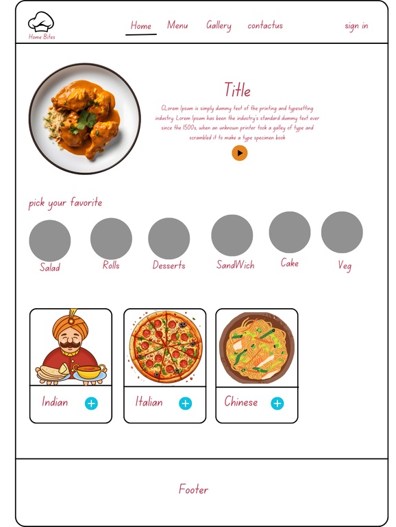
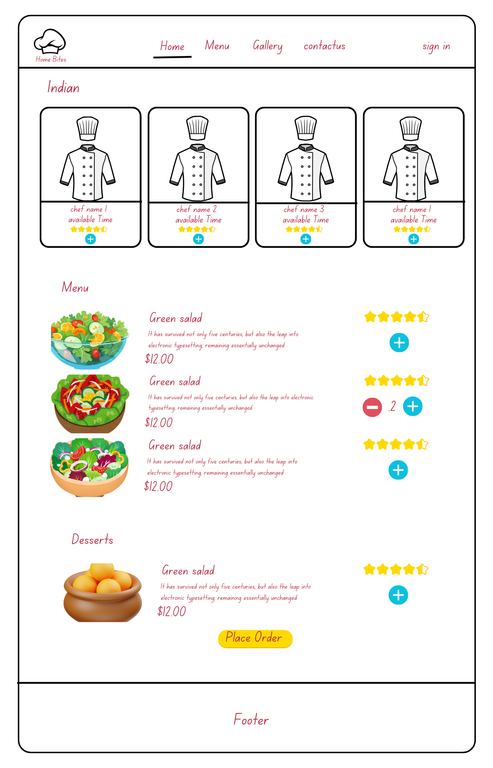
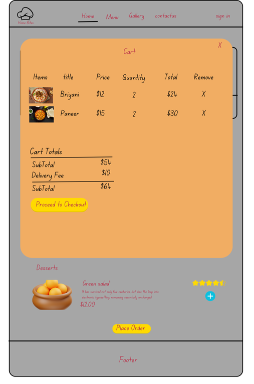
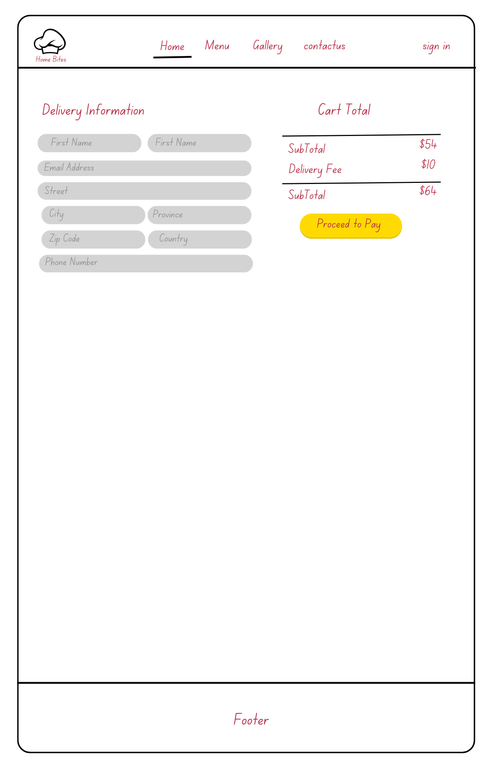

# Project Title

**_Home Bites_**

### Overview

The Ethnic Home Chef Food Delivery App is an innovative online platform that connects users in Canada with home chefs from their own ethnic backgrounds, allowing them to discover and enjoy authentic dishes from their home countries. This app enhances cultural exchange and community engagement by enabling users to browse various cuisines, read chef profiles, and place seamless orders for homemade meals. It empowers home chefs to showcase their culinary talents and grow their businesses while fostering a vibrant food community where individuals can experience the flavors of home and support local, home-based businesses. By bridging the gap between diverse communities through food, the platform enriches the dining experience and strengthens bonds within multicultural neighborhoods.

### Problem Space

**Cultural Disconnection:** Expatriates often struggle to find authentic ethnic cuisine, leading to feelings of nostalgia and cultural disconnection.

**Limited Dining Options:** Traditional restaurants may not fully capture homemade flavors, resulting in unmet cravings for familiar dishes.

**Demand for Diversity:** There is a growing demand for diverse dining options in Canada's multicultural society, but many individuals lack resources to discover local home chefs.

**Empowerment of Home Chefs:** The app provides an opportunity for skilled home cooks to turn their passion into a business, fostering entrepreneurship within communities.

**Community Connection:** The platform strengthens cultural ties by enabling users to enjoy homemade meals that resonate with their heritage.

**Economic Opportunities:** It encourages economic growth by supporting local home-based businesses, enriching the culinary landscape in Canada.

### User Profile

**Target Users:**
Expatriates and immigrants will use the app to find authentic ethnic cuisine, while food enthusiasts and families will seek unique meal options for themselves and gatherings.

**Home Chefs:**
Skilled home cooks can showcase their culinary talents, manage orders, and connect with customers through the app.

**Catering Services:**
Event planners can use the platform to find chefs for specific ethnic cuisines, allowing for customized meal options.

**Special Considerations:**
The app must be culturally sensitive, accommodating dietary restrictions, and ensuring compliance with food safety and quality standards.

User Experience: An intuitive interface and multi-language support are essential for easy navigation and accessibility for a diverse user base.

### Features

As a user,
**Home Page:**
_Description:_ I want to visit the home page to view featured chefs and popular dishes, so I can quickly discover new and authentic meal options from my cultural background. The home page will include a search bar for easy navigation and links to browse different cuisines.

**Food Ordering Page:**
_Description:_ I want to access the food ordering page to view detailed menus from various home chefs, including dish descriptions, prices, and photos, so I can select my preferred meals. I should be able to customize my order based on dietary preferences and add items to my cart.

**Cart Popup Modal:**
_Description:_ I want to see a cart popup modal that displays my selected items, total price, and options to modify quantities or remove items, so I can easily review and finalize my order before checkout.

**Delivery Info Page:**
_Description:_ I want to enter my delivery information on a dedicated page, including my address and contact details, so I can ensure my order is delivered accurately and on time.

**Food Tracking Page:**
_Description:_ I want to access a food tracking page that provides real-time updates on my order status, including preparation and delivery times, so I can stay informed about when to expect my meal.

## Implementation

### Tech Stack

- React
- Express
- MySQL

  **Client Libraries**

  - react
  - react-router
  - axios
  - sass
  - sweetalert2

  **Server Libraries**

  - Express.js
  - Knex.js
  - crypto

### APIs

- No external APIs will be used for this. I will be making my own API.

### Sitemap

**Home Page**
Description: The landing page featuring highlighted chefs, popular dishes, and a search bar. Users can browse featured items and navigate to different cuisine categories.

**Food Ordering Page**
Description: A dedicated page where users can view detailed menus from various home chefs, including dish descriptions, photos, and pricing. Users can customize their orders and add items to their cart.

**Cart Popup Modal**
Description: A modal that appears when users add items to their cart, displaying selected items, total price, and options to modify quantities or remove items before proceeding to checkout.

**Delivery Info Page**
Description: A page where users enter their delivery information, including their address and contact details, to ensure accurate and timely delivery of their orders.

**Food Tracking Pag**
Description: A real-time tracking page that provides updates on the status of the user’s order, including preparation and delivery times, so users can monitor when to expect their meal.

### Visual representation

Home Page
|
|-- Food Ordering Page
| |
| |-- Cart Popup Modal
|
|-- Delivery Info Page
|
|-- Food Tracking Page

### Mockups

**Home Page**



**Order Page**



**Cart Modal Popup**



**DeliveryInfo Page**



**Tracking Order**


### Data


table Name: Food
food_id(PK)
name
description
image_url
category_id
cuisine_id
chef_id
price
created_at
updated_at

### Endpoints

**Frontend and API Endpoints**

_Frontend Endpoint:_ Path = “/” page = <Home />

## Home Page

`1. Fetch All Category Items (Initial Load)`
_Query:_
SELECT category_id, category, image_url FROM category_master

_API Endpoint:_
GET: "/api/food/category"

_Response Body:_

```Json [
{
 "category_id": 1,
 "category_name": "Italian",
 "image_url": "https://example.com/images/italian.jpg"
 },
{
 "category_id": 2,
 "category_name": "Mexican",
 "image_url": "https://example.com/images/mexican.jpg"
 }
]
```

---

`2. Fetch All Cuisines (Initial Load)`

_Frontend Endpoint:_ Path = “/:category_id” page = <Home />

_Query:_
SELECT cuisine_id, cuisine_name, image_url FROM cuisine_master

_API Endpoint:_
GET: "/api/food/cuisine"

_Response Body:_

```Json [
 {
     "cuisine_id": 1,
     "cuisine_name": "Pasta",
     "image_url": "https://example.com/images/pasta.jpg"
 },
 {
     "cuisine_id": 2,
     "cuisine_name": "Tacos",
     "image_url": "https://example.com/images/tacos.jpg"
 }
]

```

---

`3. Fetch All Chef Details (Initial Load)`

_Query:_
SELECT ch.chef_id, ch.chef_name, ch.emailid, ch.phoneNum, c.cuisine_name FROM chef_master ch JOIN cuisine c ON c.cuisine_id = ch.cuisine_id WHERE ch.topChef = "Y"

_API Endpoint:_
GET: "/api/food/chef"

_Response Body:_

```Json [
 {
     "chef_id": 1,
     "chef_name": "Gordon Ramsay",
     "emailid": "gordon@example.com",
     "phoneNum": "123-456-7890",
     "cuisine_name": "Italian"
 },
 {
     "chef_id": 2,
     "chef_name": "Frida Kahlo",
     "emailid": "frida@example.com",
     "phoneNum": "098-765-4321",
     "cuisine_name": "Mexican"
 }
]


```

---

## order page

**Order Functionality**

_Frontend Endpoint:_ Path = “/order/:cuisine_id” page = <Order />

    ```1. Fetch Chefs by Cuisine```

_Query:_
SELECT ch.chef_id, ch.chef_name, ch.availableTime, ch.rating FROM chef_master ch WHERE ch.cuisine_id = "1234"

_API Endpoint:_
GET: "/api/order/chef/:cuisine_id"

_Response Body:_

```Json [
 {
     "chef_id": 1,
     "chef_name": "Gordon Ramsay",
     "available_time": "10:00 AM - 8:00 PM",
     "rating": 5
 }
]
```

`2. Fetch Foods by Chef and Cuisine`

_Frontend Endpoint:_ Path = “/order/:chef_id/:cuisine_id” page = <Order />

_Query:_
SELECT f.food_id, f.food_name, f.description, f.price, f.image_url, f.rating FROM food WHERE chef_id = "123" AND cuisine_id = "1234"

_API Endpoint:_
GET: "/api/order/:chef_id/:cuisine_id"

_Response Body:_

```Json [
 {
     "food_id": 1,
     "food_name": "Margherita Pizza",
     "description": "Classic pizza with fresh mozzarella",
     "price": 10.00,
     "image_url": "https://example.com/images/pizza.jpg",
     "rating": 4.5
 }
]
```

---

**cart modal popup**

`1. Add Order to Cart`

_Request Body:_

```Json
{
    "Order_id": "ord_1234",
    "User_id": "user_5678",
    "Total_items": 2,
    "Total_amount": 60.00,
    "Status": "pay pending",
    "Payment": "N"
}

```

_API Endpoint:_
POST: "/api/cart/order"

_Response Body:_

```Json
{
  "Order_id": "ord_1234"
}

```

---

`2. Add Items to Invoice`

_Request Body:_

```Json
[
    {
        "User_id": "user_5678",
        "Chef_id": "1",
        "Food_id": "1",
        "Order_id": "ord_1234",
        "Quantity": 2,
        "Price": 10.00,
        "Total_price": 20.00
    },
    {
        "User_id": "user_5678",
        "Chef_id": "1",
        "Food_id": "2",
        "Order_id": "ord_1234",
        "Quantity": 1,
        "Price": 7.00,
        "Total_price": 7.00
    }
]


```

_API Endpoint:_
POST: "/api/cart/invoice"

_Response Body:_

```Json
[
  {
      "Invoice_id": "inv_001"
  },
  {
      "Invoice_id": "inv_002"
  }
]


```

---

**Delivery Info Page**

_Frontend Endpoint:_ Path = “/deliveryInfo/” page = <DeliveryInfo />

`1. Fetch Delivery Info`

_Request Body:_

```Json
{
    "Order_id": "ord_1234",
    "First_name": "John",
    "Last_name": "Doe",
    "Email_id": "john@example.com",
    "Phone_num": "123-456-7890",
    "Street": "123 Elm St",
    "City": "Toronto",
    "Province": "ON",
    "Zip_code": "M4B 1B3",
    "Country": "Canada"
}


```

_API Endpoint:_
POST: "/api/cart/delivery"

_Response Body:_

```Json
{
  "delivery_id": "del_5678"
}


```

---

`2. Update Order Status and Payment`

_Request Body:_

```Json
{
    "Status": "processing",
    "Payment": "Y"
}


```

_API Endpoint:_
PATCH: "/api/cart/order"

_Response Body:_

```Json
 {

    	Status : "success”

  }


```

---

**Order Tracking page**

_Frontend Endpoint:_ Path = “/myorder/” page = <MyOrder />

`1. Fetch Invoice Details`

_Query_

SELECT i.user_id, COUNT(i.invoice_id) AS total_invoices, GROUP_CONCAT(CONCAT(f.food_name, ' X ', i.quantity) SEPARATOR ', ') AS food_items_quantities, SUM(i.quantity) AS overall_total_quantity, SUM(i.totalPrice) AS overall_total_price, o.status FROM Invoice i JOIN Food f ON i.food_id = f.food_id JOIN Order o ON i.order_id = o.order_id WHERE i.user_id = ? AND i.recordactive = 'Y' GROUP BY i.user_id, o.status

_API Endpoint:_
GET: "/api/order/"

_Response Body:_

```Json
{
    "Total_items": 2,
    "food_items_quantities": "Pizza X 2, Salad X 1",
    "overall_total_price": 27.00,
    "Status": "processing"
}

```

## Roadmap

**Task Breakdown and Timeframes**

## Day 1 (October 16): Setting Up Project Environment

-Task 1.1: Initialize project structure
-Task 1.2: Set up folder structure and common components

## Day 2 (October 20): Basic Frontend Components

Task 2.1: Build basic UI components
Task 2.2: Implement Axios for API calls

## Day 3 (October 21): Back-end API Development

Task 3.1: Set up MySQL database tables
Task 3.2: Build API endpoints

## Day 4 (October 22): Cart and Order Functionality

Task 4.1: Cart modal and order processing on the frontend
Task 4.2: Handle order submission

## Day 5 (October 23): Delivery and Tracking

Task 5.1: Delivery info and tracking pages
Task 5.2: Add API endpoints for handling delivery details

## Day 6 (October 24): Error Handling, Authentication, and Validation

Task 6.1: Error handling on frontend using SweetAlert2
Task 6.2: Backend validation and security (crypto)

## Day 7 (October 25): Styling and Final Touches

Task 7.1: Style using Sass
Task 7.2: Final bug fixes and optimization

## Day 8 and 9 Buffer Days (October 26-27)

---

## Future Implementations

`User Authentication and Profile Management`

Allow users to create accounts, log in, and manage profiles.
Save past orders and favorite chefs/foods for easier repeat ordering.

`Payment gateway`

implementing payment gateway with help of 3rd party stripe library

`Chef Ratings and Reviews`

Implement a feature for users to rate and review chefs after an order.
Display average ratings on chef profiles and food items.

`Referral and Reward System`

Add a referral system where users can invite friends and receive discounts or rewards.
Implement a loyalty program that gives users points for each order, which can be redeemed for discounts.

`Push Notifications or Email Alerts`

Notify users about their order status (order received, being prepared, out for delivery) via push notifications or emails.

`Advanced Search and Filter Options`

Enhance the search feature by allowing users to filter by price range, chef rating, delivery time, or specific ingredients in dishes.
These features would add significant value to the application if time permits before the Capstone due date.
